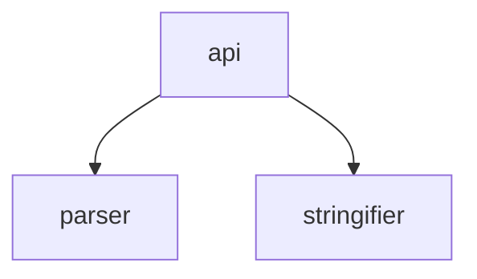

# Pathstruct

<p align="right"><code>99.31% cov</code>&nbsp;<code>253 sloc</code>&nbsp;<code>24 files</code>&nbsp;<code>4 deps</code>&nbsp;<code>13 dev deps</code></p>

Parse and stringify data structures embedded in file paths.

<br />

<!-- START doctoc generated TOC please keep comment here to allow auto update -->
<!-- DON'T EDIT THIS SECTION, INSTEAD RE-RUN doctoc TO UPDATE -->
## Table of Contents

- [Install](#install)
- [Example Usage](#example-usage)
- [Architecture](#architecture)

<!-- END doctoc generated TOC please keep comment here to allow auto update -->

## Install

###### <p align="right"><a href="https://www.npmjs.com/package/pathstruct">https://www.npmjs.com/package/pathstruct</a></p>
```sh
npm install pathstruct
```

## Example Usage

### parse

Parse key-value pairs from a file path:

```js
const pathstruct = require('pathstruct');
const str = 'event="Birthday party"/IMG1234 caption="Blowing out candles".jpg';
const obj = pathstruct.parse(str);
// { event: 'Birthday party', caption: 'Blowing out candles' }
```

Parse key-value pairs including arrays and nested object structures:

```js
const pathstruct = require('pathstruct');
const str = 'val=foobar arr=[foo,bar] x.val=foobar x.arr=[foo,bar]';
const obj = pathstruct.parse(str);
// { val: 'foobar', arr: ['foo', 'bar'], x: { val: 'foobar', arr: ['foo', 'bar']} }
```

### stringify

```js
const pathstruct = require('pathstruct');
const obj = { val: 'foobar', arr: ['foo', 'bar'], x: { val: 'foobar', arr: ['foo', 'bar']} };
const str = pathstruct.stringify(obj);
// val=foobar arr=[foo,bar] x.val=foobar x.arr=[foo,bar]
```

## Architecture

###### <p align="right"><em>Can't see the diagram?</em> <a id="link-1" href="https://github.com/mattriley/node-pathstruct#user-content-link-1">View it on GitHub</a></p>

<p align="center">
  <em>This diagram was generated with <a href="https://github.com/mattriley/node-module-composer">Module Composer</a></em>
</p>
<br>
