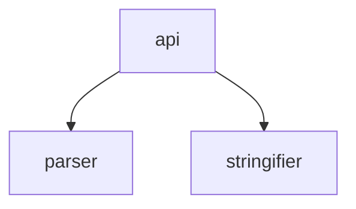

# Pathstruct

<code>100% cov</code>&nbsp;<code>216 sloc</code>&nbsp;<code>22 files</code>&nbsp;<code>4 deps</code>&nbsp;<code>9 dev deps</code>

Parse and stringify data structures embedded in file paths.

 

<!-- START doctoc generated TOC please keep comment here to allow auto update -->
<!-- DON'T EDIT THIS SECTION, INSTEAD RE-RUN doctoc TO UPDATE -->
## Table of Contents

- [Architecture](#architecture)

<!-- END doctoc generated TOC please keep comment here to allow auto update -->

## Architecture

###### 
<em>Can't see the diagram?</em> <a id="link-1" href="https://github.com/mattriley/node-pathstruct#user-content-link-1">View it on GitHub</a>

  <em>This diagram was generated with <a href="https://github.com/mattriley/node-module-composer">Module Composer</a></em>

 
